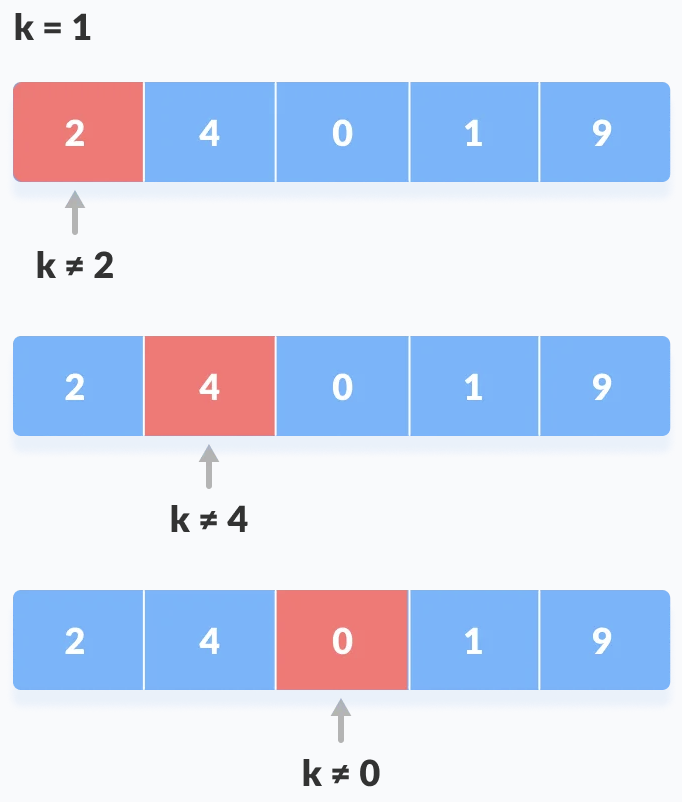
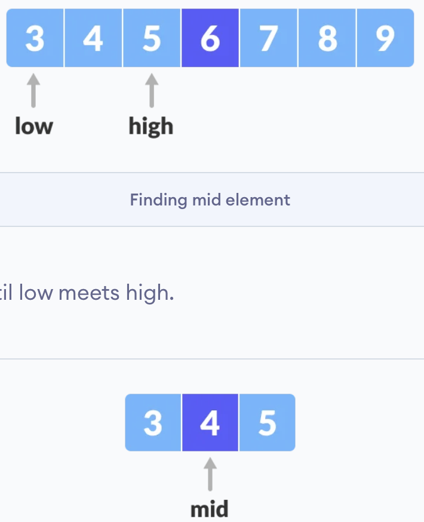
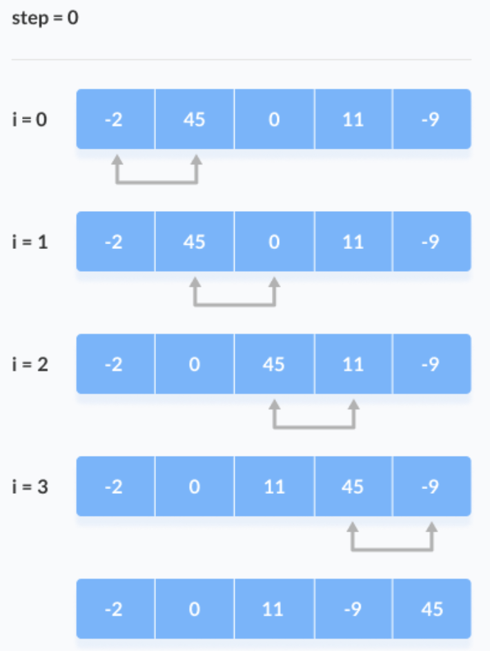
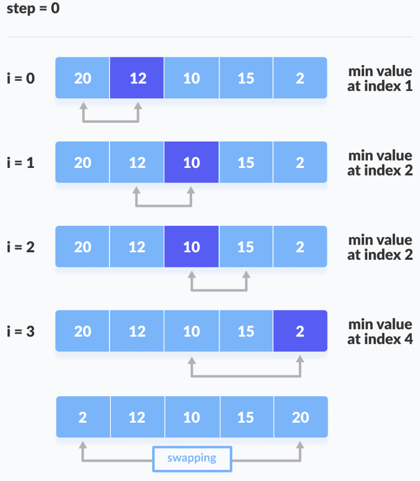
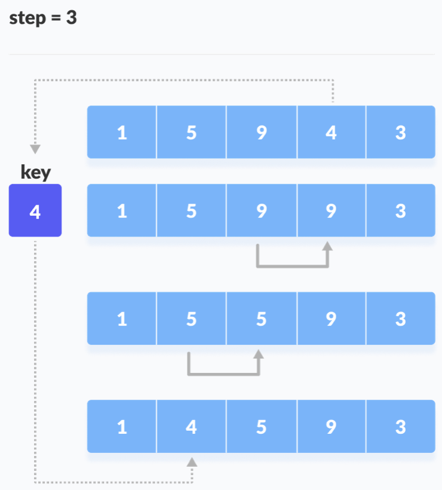
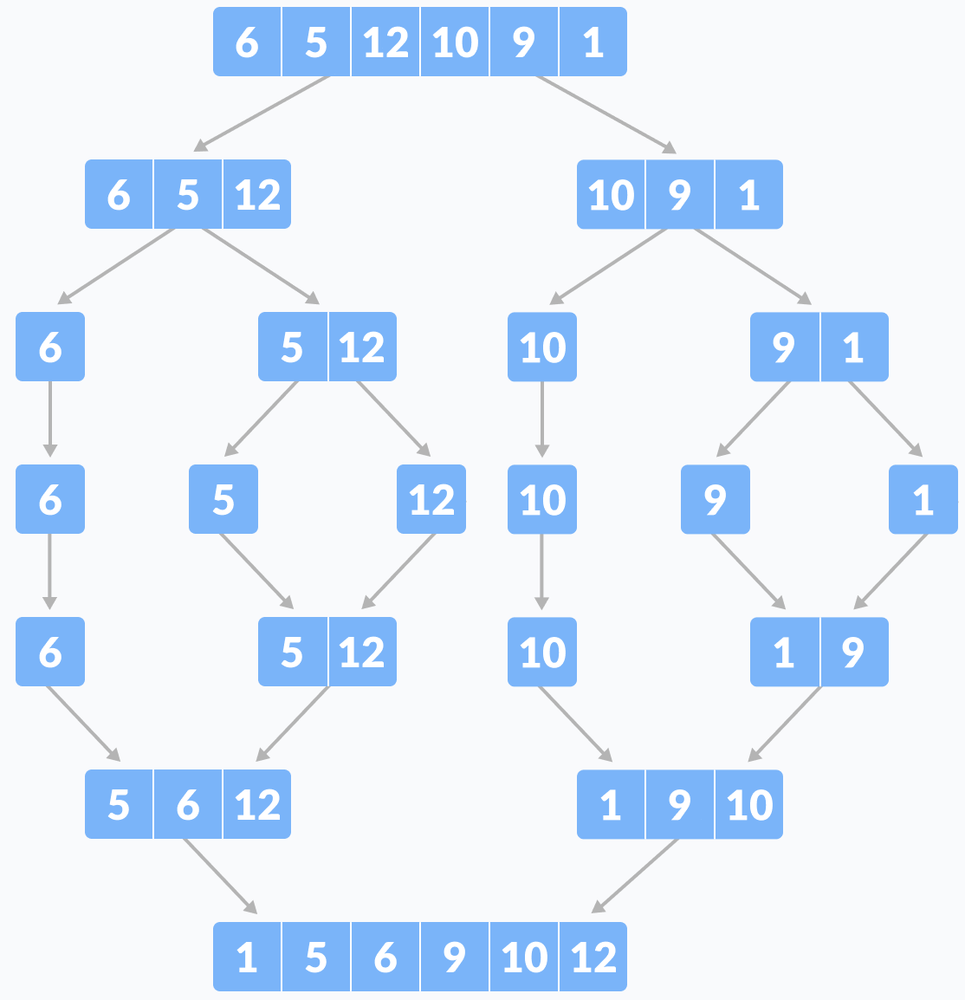
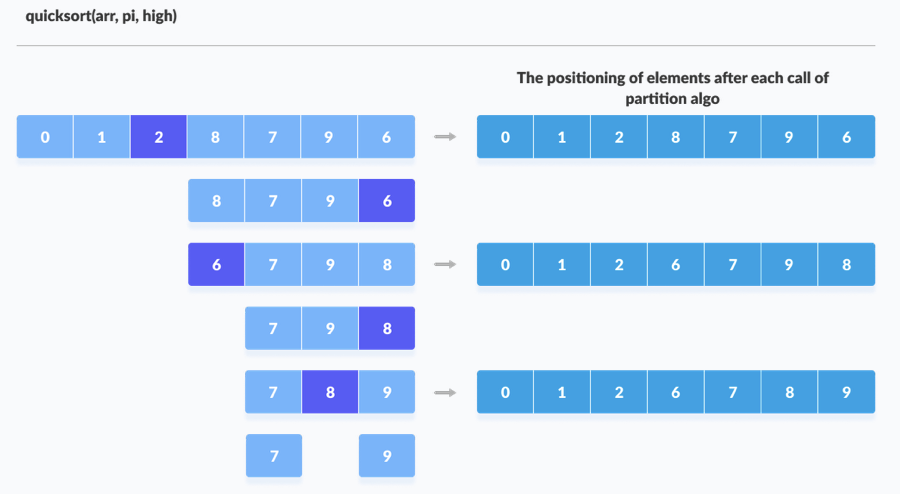
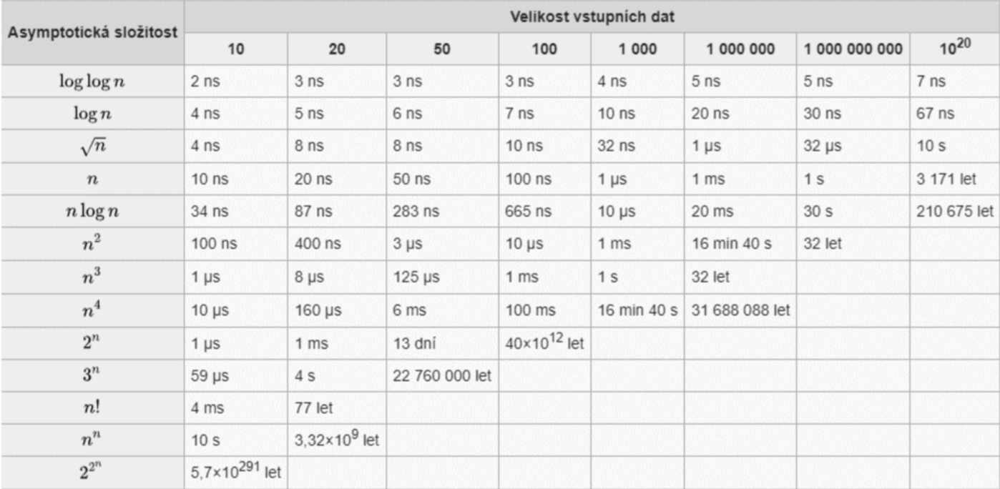
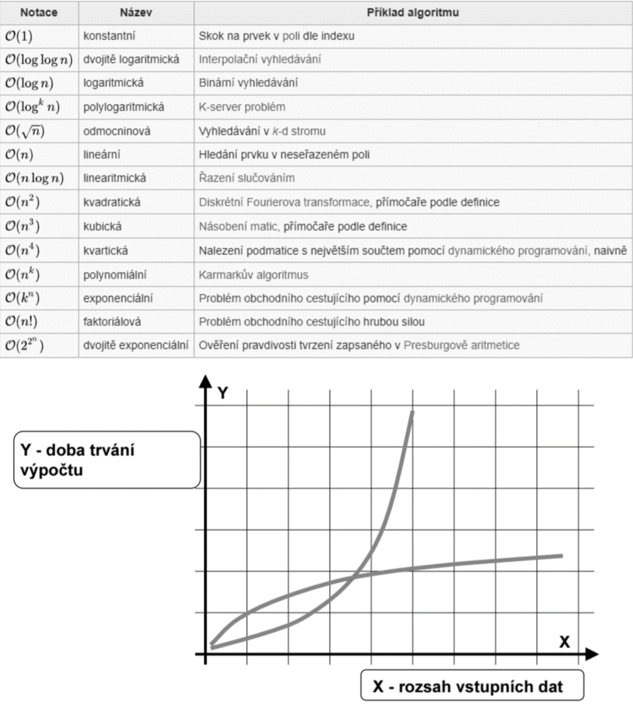

# Algoritmy pro vyhledávání a řazení, složitosti algoritmů.
- ## Algoritmy pro vyhledávání
	- **lineární vyhledávání**
		- prohledává seznam prvků jeden po druhém, dokud není hledaný prvek nenalezen nebo dojde k prohledání celého seznamu, lineární použiju u menších, NEseřazených seznamů
		- obrázek
			- 
		- kód
			- 
				```python
				# lineární vyhledávání
				def linear_search(arr, x):
					for i in range(len(arr)):
						if arr[i] == x:
							return i
					return -1
				arr = [1,2,3,4,5,6]
				x = 4
				res = linear_search(arr, x)
				if res != -1:
					print(f"Element {x} byl nalezen na pozici {res}")
				else:
					print(f"Element {x} nebyl nalezen")
				```
	- **binární vyhledávání**
		- prohledává seznam prvků, který je řazený, jde od středu a porovnává, jestli hledaný prvek není větší nebo menší než prvek na středové pozici, pokud menší, prohledává se levá část seznamu, jinak pravá část, takhle to jde dokud není hledaný prvek nalezen nebo pokud už není kde hledat, binární použiju u větších, seřazených seznamů
		- obrázek
			- 
		- kód
			- 
				```python
				# binární vyhledávání
				def binary_search(arr, x):
					low = 0
					high = len(arr) - 1
					mid = 0
					while low <= high:
						mid = (high + low) // 2
						if arr[mid] < x:
							low = mid + 1
						elif arr[mid] > x:
							high = mid -1
						else:
							return mid
					return -1
				arr = [1,2,3,4,5,6]
				x = 4
				res = binary_search(arr x)
				if res != -1:
					print(f"Element {x} byl nalezen na pozici {res}")
				else:
					print(f"Element {x} nebyl nalezen")
				```
- ## Algoritmy na řazení
	- **bubble sort**
		- prochází se seznamem prvků a porovnávají se sousední prvky, pokud jsou prvky ve špatném pořadí, jsou prohozeny, opakuje se dokud není celý seznam seřazen
		- obrázek
			- 
		- kód
			- 
				```python
				def bubble_sort(arr):
					n = len(arr)
					for i in range(n):
						for j in range(0, n-i-1):
							if arr[j] > arr[j+1]:
								arr[j], arr[j+1] = arr[j+1], arr[j]
					return arr
				arr = [38, 27, 43, 3, 9, 82, 10]
				print("Original array :", arr)
				bubble_sort(arr)
				print("Sorted array :", arr)
				```
	- **selection sort**
		- prochází se seznamem prvků a vybírá se nejmenší prvek, ten se pak přesune na začátek seznamu, to se opakuje dokud není seřazeno
		- obrázek
			- 
		- kód
			- 
				```python
				def selection_sort(arr):
					for i in range(len(arr)):
						min_idx = i
							for j in range(i+1, len(arr)):
								if arr[min_idx] > arr[j]:
									min_idx = j arr[i], arr[min_idx] = arr[min_idx], arr[i]
					return arr
				arr = [38, 27, 43, 3, 9, 82, 10]
				print("Original array :", arr) 
				selection_sort(arr)
				print("Sorted array :", arr)
				```
	- **insertion sort**
		- vybere ze seznamu neseřazený prvek a přesune ho do vhodné pozice v seřazené části seznamu
		- obrázek
			- 
		- kód
			- 
				```python
				def insertion_sort(arr):
					for i in range(1, len(arr)):
						key = arr[i]
						j = i-1
						while j >= 0 and key < arr[j]
							arr[j+1] = arr[j]
							j -= 1
						arr[j+1] = key
					return arr
				arr = [38,27,43,3,9,82,10]
				print(f"Original array {arr}")
				merge_sort(arr)
				print(f"Sorted array: {arr}")
				```
	- **merge sort**
		- využívá principu dělení a slučování → opakované rozdělení seznamu na menší části a následné sloučení těchto částí zpět do jednoho seřazeného seznamu
		- obrázek
			- 
		- kód
			- 
				```python
				def merge_sort(arr):
					if len(arr) > 1:
						mid = len(arr)//2
						L = arr[:mid]
						R = arr[mid:]
						merge_sort(L)
						merge_sort(R)
						i = j = k = 0
						while i < len(L) and j < len(R):
							if L[i] < R[j]:
								arr[k] = L[i]
								i += 1
							else:
								arr[k] = R[j]
								j += 1
							k += 1
						while i < len(L):
							arr[k] = L[i]
							i += 1
							k += 1
						while j < len(R):
							arr[k] = R[j]
							j += 1
							k += 1
					return arr
				arr = [38,27,43,3,9,82,10]
				print(f"Original array {arr}")
				merge_sort(arr)
				print(f"Sorted array: {arr}")
				```
	- **quicksort**
		- princip dělení a slučování jako merge sort, vybere se pivot ze seznamu a rozdělí se ostatní prvky na menší a větší než pivot, opakuje se dokud není celý seznam seřazen
		- obrázek
			- 
		- kód
			- 
				```python
				# příklad quicksortu
				def partition(arr, low, high):
					i = (low-1)
					pivot = arr[high]
					for j in range(low, high):
						if arr[j] <= pivot:
							i = i+1
							arr[i], arr[j] = arr[j], arr[i]
							
					arr[i+1], arr[high] = arr[high], arr[i+1]
					return (i+1)
				def quick_sort(arr, low, high):
					if low < high:
						pi = partition(arr, low, high)
						quick_sort(arr, low, pi-1)
						quick_sort(arr, pi+1, high)
					return arr
				arr = [38,27,43,3,9,82,10]
				print(f"Original array: {arr}")
				n = len(arr)
				quick_sort(arr, 0, n-1)
				print(f"Sorted array: {arr}")
				```
- ## Složitosti algoritmů
	- měřítko toho, jak rychle se algoritmus zvyšuje svojí spotřebou zdrojů (paměť a čas) s rostoucí velikosti vstupu
	- **asymptotická složitost**
		- asymptotická složitost algoritmu A je řád růstu f(N), která charakterizuje počet elementárních operací algoritmu A při zpracování dat o rozsahu N
		- **řád funkce**
			-  řád růstu funkce f je taková “co nejjednodušší” funkce g, pro kterou platí, že f je asymptoticky ohraničená funkcí g z obou stran (až na konstantu), řád určím tak, že zanedbám aditivní členy rostoucí pomaleji nebo stejně $(7*2^N+2*2^{N-1}=2^N)$, multiplikativní konstantu  $(2N=N)$
		- obrázek
			- 
	- **amortizovaná složitost**
		- určuje časovou složitost jako průměr v sekvenci nehorších případů, na rozdíl od průměrné nevyužívá pravděpodobnost a je zaručená, může mít lepší průběh než asymptotická (ASS)
		- algoritmy s vysokou ASS často mění strukturu dat - promítá se do časové složitosti potom se špatný případ nestane dlouhou dobu - nastane jeho amortizace příklad dynamického pole - může nastat realokace (zvýšení složitosti) a nemusí
		- obrázek
			- 
		- kód
			- 
				```python
				pocet = 0
				for i in a:
					if i == sum(b):
						pocet += 1
				print(pocet)
				pom = sum(b)
				pocet = 0
				for i in a:
					if i == pom:
						pocet += 1
				print(pocet)
				```
		- **první řešení** - N průchodů cyklem for, v každém z nich N operací (součet pole b) = $N*N=N^2$, asymptotická složitost = $N$
		- **druhé řešení** - N průchodů cyklem for, před prvním průchodem N operací = $N+N = 2N$, asymptotická složitost = $N$